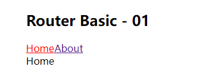

# 我的需求：
+ Vue Router 是Vue官方的路由管理器，是Vue用来实现SPA的插件。它和 Vue.js 的核心深度集成，让构建单页面应用(SPA)变得易如反掌

# <font color="#F56C6C">环境：</font>
- 不同的版本可能配置不一直，当前使用的版本。
  - "vue": "^3.2.13"
  - "vue-router": "^4.1.6"

<!--more-->

***

# npm 安装
执行命令：
``` 
npm install vue-router@4
```
# 入门
注意：组件包括两种，路由组件和非路由组件，非路由组件放在components文件夹中，路由组件放在另一个文件夹中，通常命名为views或者pages。
## src下新建router文件夹,新建index.js，定义路由器模块 router/index.js，内容如下：
``` 
import {createRouter, createWebHistory} from "vue-router";
import about from "../views/About.vue";
import home from "../views/Home.vue";

const routes = [
    {
        path: "/about",
        name: "关于",
        component: about,
        meta: {
            requireAuth: false,
        },
    }, {
        path: "/home",
        name: "首页",
        component: home,
        meta: {
            requireAuth: true,
        },
    },

];

const router = createRouter({
    history: createWebHistory(process.env.BASE_URL),
    routes
});

export default router;
```
## 在入口的main.js中引入路由器，并进行配置：
```
import {
    createApp
} from 'vue'
import App from './App.vue'
import router from './router'

const app = createApp(App)
app.use(router)
app.mount('#app')
```
## App.vue中使用路由组件标签 <router-link>和<router-view>：
```
<template>
  <div class="container">
    <div class="row">
      <div class="col-xs-offset-2 cool-xs-8">
        <div class="page-header"><h2>Router Basic - 01 </h2></div>
      </div>
    </div>

    <div class="row">
      <div class="col-xs-2 col-xs-offset-2">
        <div class="list-group">
          <router-link to="/home" class="list-group-item">Home</router-link>
          <router-link to="/about" class="list-group-item">About</router-link>
        </div>
      </div>
      <div class="col-xs-6">
        <div class="panel">
          <div class="panel-body">
            <router-view></router-view>
          </div>
        </div>
      </div>
    </div>
  </div>

</template>

<script>

export default {}
</script>

<style>
.container {
  width: 1000px;
  margin: 0 auto;
}

.router-link-active {
  color: red !important;
}
</style>
```
## 编辑路由组件的内容
Home.vue
```
<template>
  <div>
    Home
  </div>
</template>

<script>
export default {}
</script>
<style>
</style>
```
About.vue
```
<template>
  <div>
    About
  </div>
</template>

<script>
export default {name: "About.vue"}
</script>
<style scoped>
</style>
```
## 结果：


