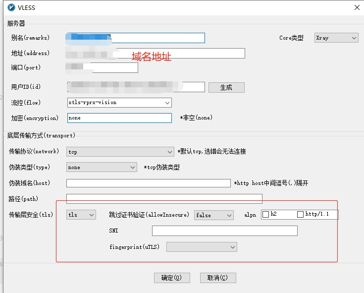

# 原因
+ 因许可理念之争，VLESS和XTLS的作者单独创建了Xray项目，目前是V2ray的超集。xray性能和安全性要更高一些。

<!--more-->

***
# 配置服务器
环境：服务器系统centos 7 64位
## 生成证书
### 安装acme
```
curl https://get.acme.sh | sh
ln -s /root/.acme.sh/acme.sh /usr/local/bin/acme.sh
acme.sh --set-default-ca --server letsencrypt
```
### 申请证书+安装证书
如果提示没有socat，先安置socat
>yum install socat
生成证书
```
acme.sh --issue -d 域名  --standalone --keylength ec-256
acme.sh --install-cert -d 域名 --ecc --fullchain-file /etc/ssl/private/fullchain.cer --key-file /etc/ssl/private/private.key
chown -R nobody:nogroup /etc/ssl/private/
```
此时在/etc/ssl/private目录下面就有对应的证书了
## 安装脚本
>bash -c "$(curl -L https://github.com/XTLS/Xray-install/raw/main/install-release.sh)" @ install
## 获取用户ID
之前的脚本，不用手动配置脚本即可使用，现在使用以上脚本，需要自己配置config.json文件，首先获取用户ID，运用指令：
>cat /proc/sys/kernel/random/uuid 
创建一个用户 id ，并记住这个id号；
``` 
[root@xxxx ~]# cat /proc/sys/kernel/random/uuid 
08ef6234-dcc0-45d1-9954-f9490cb2beb2
```
## 配置
查看官网https://github.com/XTLS/Xray-examples/tree/main/VLESS-TCP-XTLS-Vision推荐的配置参数，复制服务端文件到本地，并修改相关参数。
配置文件路径为：/usr/local/etc/xray/config.json，可以使用“vi”指令创建并打开文本，具体指令如下：
>vi /usr/local/etc/xray/config.json
``` 
{
    "log": {
        "loglevel": "warning"
    },
    "routing": {
        "domainStrategy": "IPIfNonMatch",
        "rules": [
            {
                "type": "field",
                "ip": [
                    "geoip:cn"
                ],
                "outboundTag": "block"
            }
        ]
    },
    "inbounds": [
        {
            "listen": "0.0.0.0", // "0.0.0.0" Indicates listening to both IPv4 and IPv6
            "port": 443, // The port on which the server listens
            "protocol": "vless",
            "settings": {
                "clients": [
                    {
                        "id": "", // User ID, perform xray uuid generation, or a string of 1-30 bytes
                        "flow": "xtls-rprx-vision"
                    }
                ],
                "decryption": "none",
                "fallbacks": [
                    {
                        "dest": "8001",
                        "xver": 1
                    },
                    {
                        "alpn": "h2",
                        "dest": "8002",
                        "xver": 1
                    }
                ]
            },
            "streamSettings": {
                "network": "tcp",
                "security": "tls",
                "tlsSettings": {
                    "rejectUnknownSni": true,
                    "minVersion": "1.2",
                    "certificates": [
                        {
                            "ocspStapling": 3600,
                            "certificateFile": "/etc/ssl/private/fullchain.cer", // For the certificate file, it is recommended to use fullchain (full SSL certificate chain). If there is only a website certificate, v2rayN can be used but v2rayNG cannot be used. Usually, the extension is not distinguished
                            "keyFile": "/etc/ssl/private/private.key" // private key file
                        }
                    ]
                }
            },
            "sniffing": {
                "enabled": true,
                "destOverride": [
                    "http",
                    "tls"
                ]
            }
        }
    ],
    "outbounds": [
        {
            "protocol": "freedom",
            "tag": "direct"
        },
        {
            "protocol": "blackhole",
            "tag": "block"
        }
    ],
    "policy": {
        "levels": {
            "0": {
                "handshake": 2, // The handshake time limit when the connection is established, in seconds, the default value is 4, it is recommended to be different from the default value
                "connIdle": 120 // Connection idle time limit in seconds, the default value is 300, it is recommended to be different from the default value
            }
        }
    }
}
```
直接复制配置即可使用，id就是上面第二步获取的用户id，也可以是自己生成的UUID
因为这里使用了回流，所以要在Nginx配置对应的端口
```
user nginx;
worker_processes auto;

error_log /var/log/nginx/error.log notice;
pid /var/run/nginx.pid;

events {
    worker_connections 1024;
}

http {
    log_format main '[$time_local] $proxy_protocol_addr "$http_referer" "$http_user_agent"';
    access_log /var/log/nginx/access.log main;

    map $http_upgrade $connection_upgrade {
        default upgrade;
        ""      close;
    }

    map $proxy_protocol_addr $proxy_forwarded_elem {
        ~^[0-9.]+$        "for=$proxy_protocol_addr";
        ~^[0-9A-Fa-f:.]+$ "for=\"[$proxy_protocol_addr]\"";
        default           "for=unknown";
    }

    map $http_forwarded $proxy_add_forwarded {
        "~^(,[ \\t]*)*([!#$%&'*+.^_`|~0-9A-Za-z-]+=([!#$%&'*+.^_`|~0-9A-Za-z-]+|\"([\\t \\x21\\x23-\\x5B\\x5D-\\x7E\\x80-\\xFF]|\\\\[\\t \\x21-\\x7E\\x80-\\xFF])*\"))?(;([!#$%&'*+.^_`|~0-9A-Za-z-]+=([!#$%&'*+.^_`|~0-9A-Za-z-]+|\"([\\t \\x21\\x23-\\x5B\\x5D-\\x7E\\x80-\\xFF]|\\\\[\\t \\x21-\\x7E\\x80-\\xFF])*\"))?)*([ \\t]*,([ \\t]*([!#$%&'*+.^_`|~0-9A-Za-z-]+=([!#$%&'*+.^_`|~0-9A-Za-z-]+|\"([\\t \\x21\\x23-\\x5B\\x5D-\\x7E\\x80-\\xFF]|\\\\[\\t \\x21-\\x7E\\x80-\\xFF])*\"))?(;([!#$%&'*+.^_`|~0-9A-Za-z-]+=([!#$%&'*+.^_`|~0-9A-Za-z-]+|\"([\\t \\x21\\x23-\\x5B\\x5D-\\x7E\\x80-\\xFF]|\\\\[\\t \\x21-\\x7E\\x80-\\xFF])*\"))?)*)?)*$" "$http_forwarded, $proxy_forwarded_elem";
        default "$proxy_forwarded_elem";
    }

    server {
        listen 80;
        return 301 https://$host$request_uri;
    }

    server {
        listen 127.0.0.1:8001 proxy_protocol;
        listen 127.0.0.1:8002 http2 proxy_protocol;
        set_real_ip_from 127.0.0.1;

        location / {
            sub_filter                         $proxy_host $host;
            sub_filter_once                    off;

            proxy_pass                         https://www.lovelive-anime.jp;
            proxy_set_header Host              $proxy_host;

            proxy_http_version                 1.1;
            proxy_cache_bypass                 $http_upgrade;

            proxy_ssl_server_name on;

            proxy_set_header Upgrade           $http_upgrade;
            proxy_set_header Connection        $connection_upgrade;
            proxy_set_header X-Real-IP         $proxy_protocol_addr;
            proxy_set_header Forwarded         $proxy_add_forwarded;
            proxy_set_header X-Forwarded-For   $proxy_add_x_forwarded_for;
            proxy_set_header X-Forwarded-Proto $scheme;
            proxy_set_header X-Forwarded-Host  $host;
            proxy_set_header X-Forwarded-Port  $server_port;

            proxy_connect_timeout              60s;
            proxy_send_timeout                 60s;
            proxy_read_timeout                 60s;

            resolver 1.1.1.1;
        }
    }
}
```
因为在Nginx中使用了SSL，sub_filter，set_real_ip_from等模块，如果当时安置Nginx时没有编译相关模块，就要添加对应的模块：
j进入Nginx的安置目录，执行命令，查看已经安置的模块
>.\nginx -V
如果没有包含对应的模块，进入Nginx源码目录，执行
>./configure --prefix=/usr/local/nginx --with-http_sub_module --with-http_stub_status_module --with-http_v2_module --with-http_ssl_module --with-http_realip_module
编译【特别注意】这里不要进行make install，否则就是覆盖你之前的安装
>make
备份原有已安装好的nginx
>cp /usr/local/nginx/sbin/nginx /usr/local/nginx/sbin/nginx.bak
将刚刚编译好的nginx覆盖掉原有的nginx（这个时候【特别注意】这里nginx要停止状态）
>cp ./objs/nginx /usr/local/nginx/sbin/
启动nginx，仍可以通过命令查看是否已经加入成功
## 重启Xray
+ systemctl start xray 启动
+ systemctl stop xray 停止
+ systemctl restart xray 重启
+ systemctl status  xray 启动状态

# 打开防火墙
如果centos系统防火墙是开启的，上面第三步你用了一个端口，因此你需要打开这个端口，指令如下
添加开放端口
>firewall-cmd --zone=public --add-port=8001/tcp --permanent

重载防火墙配置，不然查看开放端口都查不到，也不能用，重载配置后即可
>firewall-cmd --reload

如果哪一天发现怎么无法使用了，有可能是IP被屏蔽，也有肯能是端口被封，这个时候就需要换个端口，别忘记防火墙开启新端口，那旧端口就可以删除了：
删除端口：
>firewall-cmd --zone=public --remove-port=8001/tcp --permanent

# 其它
在生成证书的时候，可能需要停启Nginx和建立对应的目录，如果使用v2rayN作为Windows客户的访问的时候，要记得配置底层传输方式，不然范围不通。


参考：
https://frank2019.me/articles/2023/01/02/1672622207251.html
https://acytoo.com/ladder/v2-x-ray/
https://v2xtls.org/xtls-vision%e4%bb%8b%e7%bb%8d%e5%8f%8a%e5%ae%89%e8%a3%85%e4%bd%bf%e7%94%a8/
https://www.vjsun.com/656.html
